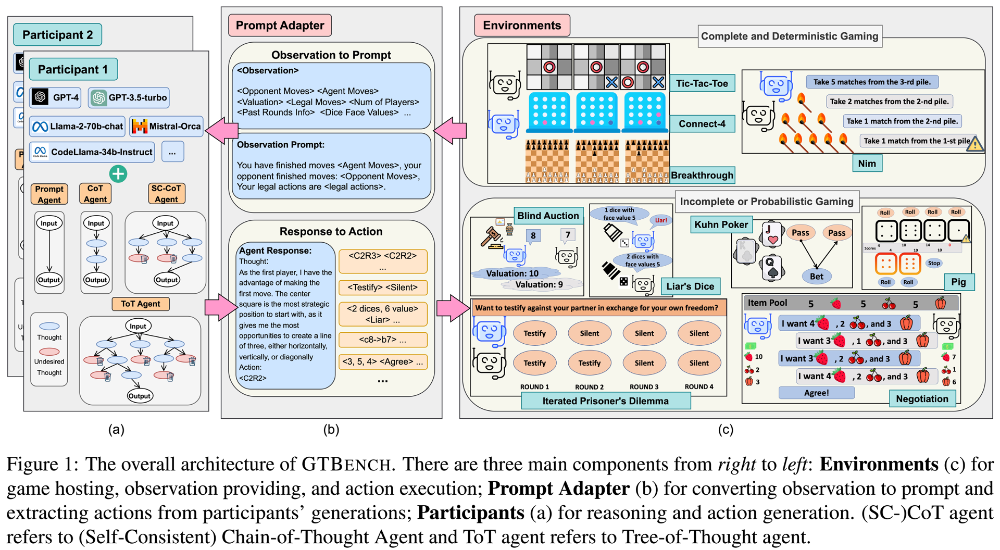

[comment]: <> (![image]&#40;logo.png&#41;)
# GTBench: Uncovering the Strategic Reasoning Limitations of LLMs via Game-Theoretic Evaluations
- **Authors:** Jinhao Duan*, Renming Zhang*, James Diffenderfer, Bhavya Kailkhura, Lichao Sun, Elias Stengel-Eskin, Mohit Bansal, Tianlong Chen, and Kaidi Xu (*equal contribution)
- [**arXiv**](https://arxiv.org/abs/2402.12348)
- [**GTBench HF Leaderboard**](https://huggingface.co/spaces/GTBench/GTBench)



## Overview
This repo contains code for our paper: [GTBench: Uncovering the Strategic Reasoning Limitations of LLMs via Game-Theoretic Evaluations](https://arxiv.org/pdf/2402.12348.pdf). 
GTBench is a language-driven environment, evaluating the strategic reasoning limitations of LLMs through game-theoretic tasks. 
GTBench is built on top of [OpenSpiel](https://github.com/google-deepmind/open_spiel), supporting 10 widely-recognized games:
- <a href="https://en.wikipedia.org/wiki/Tic-tac-toe" target="_blank">  Tic-Tac-Toe</a>
- <a href="https://en.wikipedia.org/wiki/Connect_Four" target="_blank">  Connect-4 </a>
- <a href="https://en.wikipedia.org/wiki/Breakthrough_(board_game)" target="_blank">  Breakthrough</a>
- <a href="https://en.wikipedia.org/wiki/Nim" target="_blank">  Nim</a>
- <a href="https://en.wikipedia.org/wiki/First-price_sealed-bid_auction" target="_blank">  Blind Auction</a>
- <a href="https://en.wikipedia.org/wiki/Kuhn_poker" target="_blank">  Kuhn Poker</a>
- <a href="https://en.wikipedia.org/wiki/Liar\%27s_dice" target="_blank">  Liar's Dice</a>
- <a href="https://arxiv.org/pdf/1706.05125.pdf" target="_blank">  Negotiation</a>
- <a href="https://en.wikipedia.org/wiki/Pig_(dice_game)" target="_blank">  Pig</a>
- <a href="https://en.wikipedia.org/wiki/Prisoner\%27s_dilemma" target="_blank"> Iterated Prisoner's Dilemma</a>


## Environment
Dependencies can be installed by running 

```shell
pip install -r requirements.txt
```

## LLM Inference
GTBench uses [LangChain](https://github.com/langchain-ai/langchain) for LLM Inference (`./gamingbench/chat/chat.py`), supporting
- Remote API access such as [OpenAI](https://openai.com/) / [Anyscale](https://docs.endpoints.anyscale.com) / [DeepInfra](https://deepinfra.com/models).
- OpenAI-Compatible APIs via [FastChat](https://github.com/lm-sys/FastChat?tab=readme-ov-file#openai-compatible-restful-apis--sdk).

## Scripts
### LLM-vs-X
GTBench supports 
- **LLM-vs-Conventional**: LLM agent competes against conventional solvers such as Monte Carlo Tree Search (MCTS)
- **LLM-vs-LLM**: LLM agent competes against other LLM agents. 

The following is a script for `GPT-3.5-turbo-1106 w/ Prompt Agent` vs. `GPT-3.5-turbo-1106 w/ CoT Agent`, over `Tic-Tac-Toe`
```shell
seed=0
output_root="./experiments"
exp_name='test'
num_matches=50 # number of matches
num_workers=20 # run 20 matches in parallel
threshold_matches=100 # maximum number of matches, stop criteria for low completion rate, e.g., LLM agents always generate illegal actions.
# suports all the games listed in ./gamingbench/configs/game_configs/*.yaml
game_name='tictactoe'
# supports all the llms defined in ./gamingbench/configs/model_configs/*.yaml
model_config_root='gamingbench/configs/model_configs'
llm_name='gpt-35-turbo-1106'
opponent_llm_name='gpt-35-turbo-1106'
# supports all the reasoning methods defined in ./gamingbench/agent_configs/*.yaml
agent_config_root='gamingbench/configs/agent_configs'
agent_name='prompt_agent'
opponent_agent_name='cot_agent'
declare -a api_keys=("<YOUR-OPENAIAPI-KEY>" "<YOUR_DEEPINFRA_KEY>")

python3 -m gamingbench.main \
    --num-matches ${num_matches} \
    --exp-root ${output_root}/${exp_name}/${llm_name} \
    --seed ${seed} \
    --game-name ${game_name} \
    --agent-configs ${agent_config_root}/${agent_name}.yaml ${agent_config_root}/${opponent_agent_name}.yaml \
    --model-configs ${model_config_root}/${llm_name}.yaml ${model_config_root}/${opponent_llm_name}.yaml \
    --api-keys ${api_keys} \
    --exchange-first-player \
    --num-workers ${num_workers} \
    --threshold-matches ${threshold_matches}

``````
### Customized LLM Agent

Will be ready soon.

### Upload to GTBench HF Leaderboard
Will be ready soon.

# Reference

Please cite our paper as
```
@article{duan2024gtbench,
  title={GTBench: Uncovering the Strategic Reasoning Limitations of LLMs via Game-Theoretic Evaluations},
  author={Duan, Jinhao and Zhang, Renming and Diffenderfer, James and Kailkhura, Bhavya and Sun, Lichao and Stengel-Eskin, Elias and Bansal, Mohit and Chen, Tianlong and Xu, Kaidi},
  journal={arXiv preprint arXiv:2402.12348},
  year={2024}
}
```
